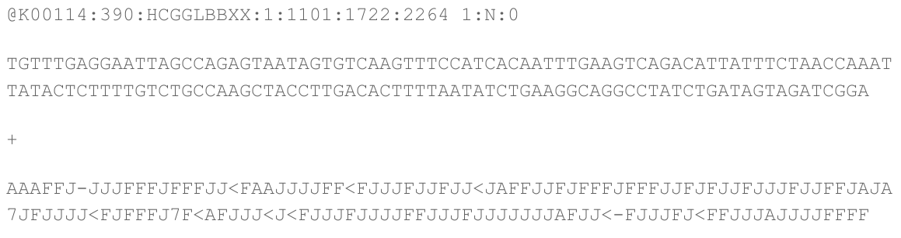

# Fastq

>Nota: Recuerde guardar todos los comandos utilizados

1. ¿Qué significa cada parte del nombre del archivo?  
2. ¿Qué tipo de archivo es? ¿Qué tipo de información contiene?  
3. Identificar los componentes de cada lectura: nombre, secuencia, calidad (Si el archivo está comprimido puede utilizar **zcat XXX.fastq.gz | less** )  
4. ¿Cuántas reads hay en total?  
5. Para la primer lectura ¿Cuál era la ubicación física de la lectura en la celda de flujo (es decir, lane, tile, x, y)?  
6. Para la primer lectura ¿cuántas bases 'C' hay? ¿cuántas bases 'A' hay? ¿Cuál es la proporción GC? ¿Para qué sirve la proporción GC?  
7. ¿Con qué herramienta podemos evaluar la calidad de las lecturas? Ejecutar por GUI (graphic user interfase) y por terminal. ¿Qué archivos fueron generados al ejecutar la herramienta por terminal?  
8. ¿Cómo es la calidad de los archivos fastq?  
9. ¿Cuál es la diferencia entre DNA y RNA? ¿Qué podemos pensar de las secuencias sobrerrepresentadas en el RNAseq?  
10. ¿Cuál es la longitud de las lecturas?  
11. ¿Qué modificaciones debemos hacer para mejorar la calidad de los archivos?  
12. Explorar opciones de TrimGalore usando el comando: trim_galore -h  
13. Evaluar cuáles son las opciones que debemos ejecutar para nuestros archivos de ADN y ARN y ejecutar (Considerar que --three_prime_clip_R1 recorta al final de la secuencia, mientras que --clip_R1 corta al principio).  
14. Volver a evaluar la calidad de las lecturas con fastqc. ¿Cómo es la calidad ahora?  
15. Por cuestiones de espacio, borrar los archivos fastq originales  
16. BONUS: Hacer un loop en bash para automatizar la ejecución de fastqc y trim_galore sobre todos los archivos de ADN y/o ARN.  
