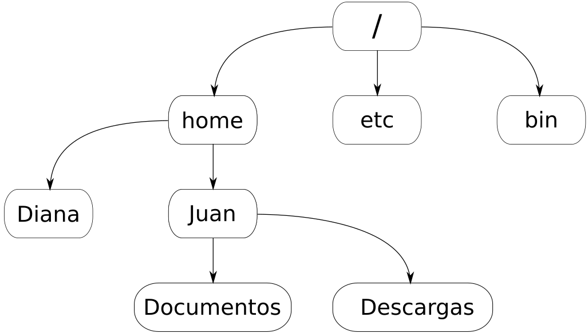

# UNIX

## Introduccion

El sistema operativo Unix existe desde 1969 cuando todavia no existia la interfaz grafica y se debia tipear cada tarea que se deseara realizar. Hoy en dia los sistemas se han orientado a ser amigables para el usuario inexperto donde los graficos y el uso del mouse tienen gran relevancia. A pesar de que el uso de la consola parezca arcaico, cuenta con numersas ventajas, sobre todo porque nos permite automatizar tareas de manera muy sencilla.
Unix es particularmente util para trabajar con archivos de texto, sobre todo cuando estos son muy grandes. El manejo es a traves de comandos en la consola, los cuales pueden ser combinados de diversas maneras para procesar datos. 

El sistema Unix con el que cuenta la maquina virtual en la que vamos a trabajar a lo largo de este workshop es un Ubuntu el cual es de las distribuciones de Linux mas amigables al usuario "normal". La consola de comando puede ser encontrada en la barra vertical a la izquierda, o mediante el atajo ctrl+alt+t 
Una vez abierta la consola ya podemos comenzar a introducir comandos. Pueden observar que antes del cursor tenemos lo que se conoce como "prompt" y esta compuesto generalmente por el nombre de usuarion, el nombre del equipo y la direccion donde nos encontramos seguido de un signo pesos ($) que anuncia el final del prompt.


## Primeros comandos

Los comandos en unix son en si programas, al escribir un comando uno le dice al sistema que quiere ejecutar ese programa suponiendo que esta instalado en la computadora. Por lo general estos comandos tienen el formato

```Bash
comando -opciones archivo
```

Vamos a ejecutar nuestro primer comando: *ls*

```Bash
ls
```

El comando *ls* lista los archivos y directorios dentro del directorio donde estamos operando. 

> Note que una vez ejecutado el comando, se muestra la salida y vuelve a aparecer el prompt, lo que nos dice que el comando termino de ejecutarse y se puede ingresar el siguiente comando. Si el prompt no fuese visible puede significar que el comando sigue operando y hay que esperar unos momentos mas.

El comando *ls* en en realidad un poco mas potente de lo que acabamos de ver. Puede listar el contenido de cualquier directorio, solo que si no le decimos cual, por defecto asume que queremo ver el contenido del directorio en el que estamos. 
Prueben ahora ejecutar:

```Bash
ls /
```
y 

```Bash
ls /etc/perl
```

En este caso */* y */etc/perl* son direcciones a distintos directorios. En Unix como en Windows las carpetas estan organizadas en forma de arboles, donde cada uno contiene otras carpetas y/o archivos y uno puede referirse a ellas mediante su direccion o *path*. Como pueden ver en la figura mas abajo, el directorio que contiene todo es simplemente una barra **/**, a este se le llama *root*, entonces cuando hicimos *"ls /"* mostramos todos los directorios contenidos en nuestro root. En el caso que queramos listar cosas en carpetas contenias dentro de otras carpetas vamos indicando la direccion separando con barras, como hicimos con */etc/perl*, esto significa que dentro de la carpeta root hay una carpeta llamada *etc*, y dentro de esta, un directorio llamado *perl*, entonces ls lista lo que hay alli.



No siempre es necesario escribir el path completo (ruta absoluta) al directorio que necesitamos, tambien podemos utilizar una ruta relativa, la cual toma como referencia el directorio en el que nos encontramos. Por ejemplo, si nos encontramos en **/home/Juan** y queremos listar los elementos en la carpeta Documentos puedo ejecutar **ls /home/Juan/Documentos** o simplemente **ls Documentos** ya que nos encontramos en la carpeta que lo contiene. Tambien podemos utilizar **..** (punto punto) para especificar que nos referimos a la carpeta inmediatamente anterior en el arbol de directorios. Por ejemplo **ls ..** listaria lo que hay en la carpeta **home**. O si queremos listar lo que hay en la carpeta **Diana** podemos ingresar **ls ../Diana**.

Como habiamos establecido anteriormente, los comandos suelen aceptar opciones que modifican su salida. Generalmente son indicados mediante un guion un tag. Por ejemplo, ls puede ejecutarse con la opcion "-l"

```Bash
ls -l Ruta_al_directorio
```
Esto nos da una lista mas detallada con informacion como permisos, tamanio del archivo, fecha de ultima modificacion, entre otros.

Para saber a ciencia cierta el funcionamiento de los comandos y las opciones que estos aceptan, podemos utilizar el comando **man** el cual nos muestra el manual del comando que le especifiquemos:

```Bash
man ls
```

### Otros comandos que nos van a ser utiles:

* **pwd:** nos da la direccion absoluta al directorio donde estamos trabajando.

```Bash
pwd
```

* **mkdir:** Nos permite crear carpetas.

```Bash
mkdir Ruta_del_directorio
```
>Nota: Al crear tanto archivos como directorios, tenga en cuenta que Unix tiene varios caracteres epeciales y no se lleva muy bien con los espacios. Intente siempre utilizar nombres sin simbolos y separados con guion o guion bajo en lugar de espacio.


* **rmdir** remueve la carpeta especificada
```Bash
mkdir Ruta_del_directorio
```

* **cd:** este es el comando para cambiar de carpeta.

```Bash
cd Path_al_directorio
```
 
* **cp:** copia archivos de un lugar a otro.

```Bash
cp path_del_archivo_a_copiar path_donde_se_lo_quiere_copiar
```
>Nota: asi como **..** se referia al directorio inmediatamente superior, **.** (punto) se refiere al directorio en el que nos encontramos, de esta manera si queremos copiar cosas en donde estamos podemos utilizar  
>**cp path_del_archivo_a_copiar .**

* **mv:** analogo a cp pero en vez de copiar mueve, osea corta y pega.

```Bash
mv path_del_archivo_a_copiar path_donde_se_lo_quiere_copiar
```
* **cat:** Imprime por pantalla el contenido de un archivo

```Bash
cat path_al_archivo
```

* **sort:** imprime las lineas de un archivo dado en orden

```Bash
sort path_al_archivo
```
>Nota 1: Si bien los comandos como sort operan sobre archivos no los modifican, ejecutar sort mostrara por pantalla el contenido ordenado pero el archivo seguira en el orden en el que estaba  


>Nota 2: El comando sort por defecto ordena alfabeticamente, ascendente y por la primera columna, uno puede modificar esto utilizando las opciones **-n** para que ordene numericamente, **-r** para que sea descendente y **-k** seguida de un numero para indicar que columna utilizar.

* **grep:** nos permite buscar alguna palabra o patron dentro de un archivo y devuelve las lineas que lo contienen.

```Bash
grep palabra_a_buscar path_al_archivo
```
>Nota: grep tiene algunas opciones interesantes, por ejemplo: **-v** hace que nos devuelva las lineas que **NO** contienen el patron indicado y **-c** hace que en vez de mostrarnos las lineas solo nos reporte la cantidad de ellas que contienen el patron.


## Redireccionando la salida

La mayoria de los comandos de Unix devuelve por defecto su salida por pantalla. Esto generalmente es conveniente, pero en muchos casos quisieramos guardar la salida en un archivo. Para esto podemos utilizar el operador **>**. Mediante el signo mayor uno puede redireccionar la salida a un archivo. Si el archivo existe sera sobreescrito, sino sera creado. Tambien se puede utilizar un doble signo mayor: **>>** con la unica diferencia de que si el archivo ya existe, concatena la salida al final del mismo en lugar de sobreescribirlo.

prueben hacer:

```Bash
ls -l > mi_lista
```

Si ahora ejecutamos ls, deberiamos ver que contamos con un nuevo archivo llamado "mi_lista", y si lo abrimos:

```Bash
cat mi_lista
```

deberia contener la salida de ejecutar **ls -l**

## Concatenando comandos

Una gran ventaja de los sistemas Unix es que nos permiten ejecutar varios comandos en tandem, donde la salida de uno puede ser utilizada como entrada del siguiente. Para esto se deben separar los comandos con la barra vertical conocida como *pipe*: **|**

ej:

```Bash
ls -l | grep "mi_"
```

Deberia reportarnos, en lugar del listado completo de elementos en nuestra carpeta, solo el archivo que creamos anteriormente "mi_lista", salvo que hayan creado otros archivos o directorios con "mi_" en el nombre. Esto es porque a la salida de **ls -l** (la lista completa de elementos) se la pasa como entrada al comando **grep "mi_"** que devuelve las lineas que contengan "mi_"

## For loops

En la consola de comandos podemos tambien ejecutar pequeños scripts, uno de los comandos mas usuales para esta tarea es **for**.
Este comando se utiliza cuando se debe aplicar la misma tarea en reiteradas ocaciones. Por ejemplo si tuviesemos muchos archivos que quisieramos descomprimir podriamos aplicar los comandos:

```Bash
files=`ls *.gz`
for file in $files; do gzip -d $file; done
```
>Nota: la consola de comando cuenta con caracteres especiales que tienen un significado particular, los mas utilizados son el asterisco (\*) y el signo de pregunta (?). \* significa cualquier caracter en cualquier cantidad (incluido ninguna), en cambio ? tiene un significado similar pero debe existir el caracter y solo puede ser uno. Por ejemplo, si tuviesemos los archivos *archivo*, *archivo_2*, *archivo_22* en nuestra carpeta y ejecutaramos **mv archivo\* ..** moveria todos a la carpeta inmediatamente superior, en cambio **mv archivo_? ..** unicamente moveria *archivo_2*.

En estas lineas lo que hacemos es definir una variable que contenga la lista de todos los archivos en nuestra carpeta que terminen en ".gz" y luego mediante un for ejecutar "gzip -d" a cada uno de ellos de manera individual.
La sintaxis es **for** seguido de una variable en la que ira almacenando cada elemento en cada iteracion, **in** seguido de la lista de elementos de los cuales extraera uno por vez, **; do** seguido de la tarea que queramos que se ejecute en cada uno de esos elementos y finaliza con **; done** que explicita que no vamos a seguir agregando comandos. Notese que podemos seguir agregando comandos siempre y cuando los separemos por **;** por ello es importante agregar el **done**.

>Nota: Observe que al definir una variable el nombre no tiene ningun caracter especial, pero al utilizarla se le antepone el signo pesos (**$**).

## Ejercicios

1. Cree una carpeta para esta ejercitación donde le sea cómodo trabajar  
2. Liste todos los archivos en el directorio references  
3. Cree una copia de 1000G.snps.b38.chr22.vcf y CosmicCodingMuts_chr22.vcf en su nuevo directorio  
4. Elimine todas las líneas que contienen el caracter # en ambos archivos  
5. Ordene ambos archivos por su segunda columna según orden numérico  
6. Cree un nuevo archivo que contenga las variantes compartidas por ambos archivos (puede utilizar el comando **join**, investiguelo con **man**)  
7. Cree otro nuevo archivo donde almacene sólo las mutaciones de Adeninas  
8. Comprima todos los archivos que ha generado en su nueva carpeta (**gzip**)  
9. Salga de la carpeta hacia un directorio superior  

